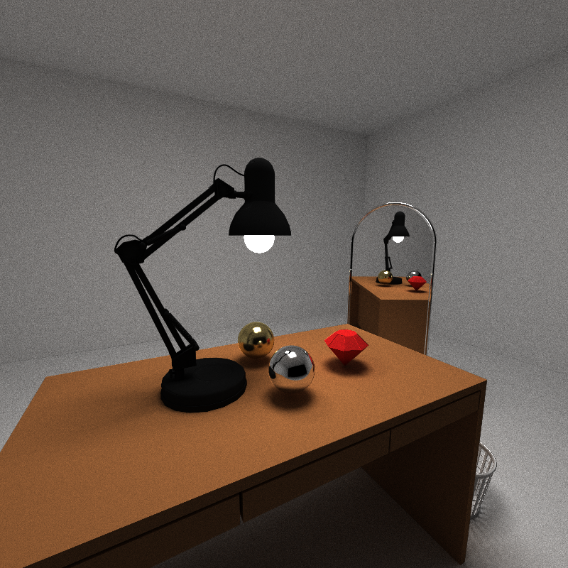
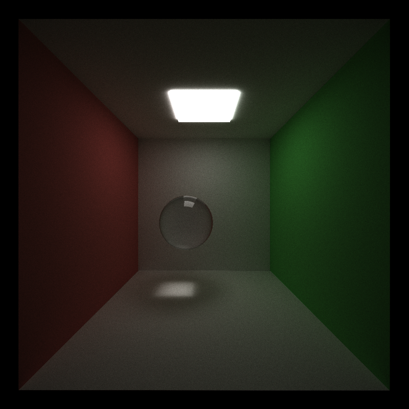
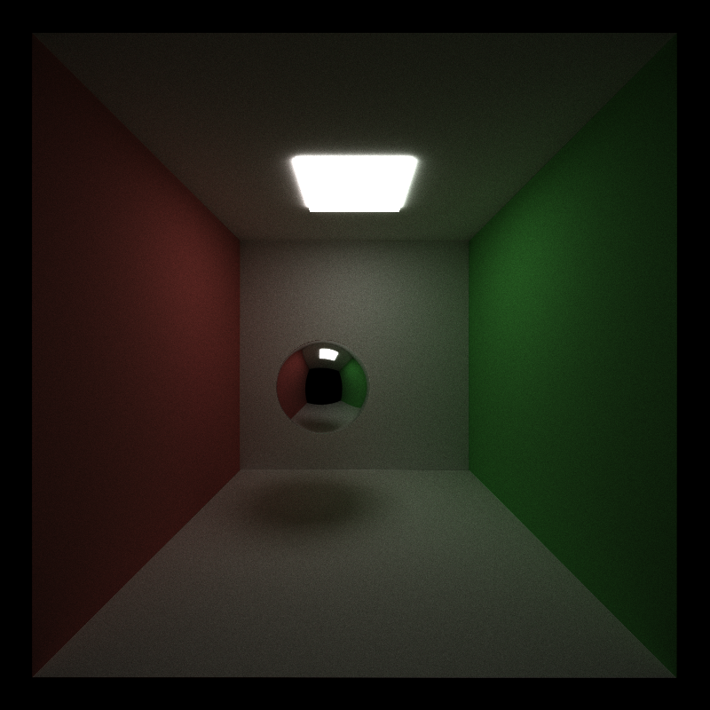
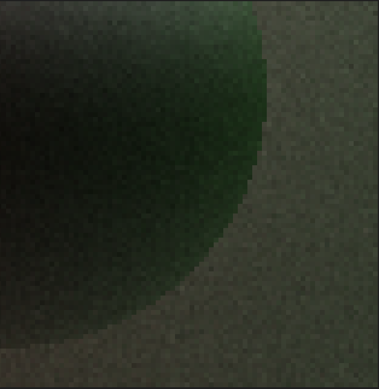
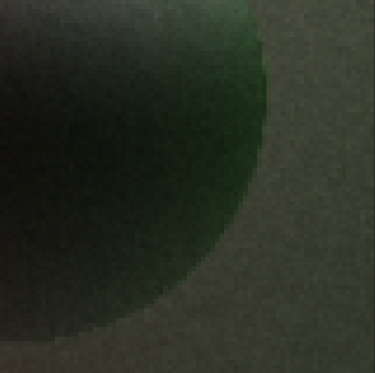
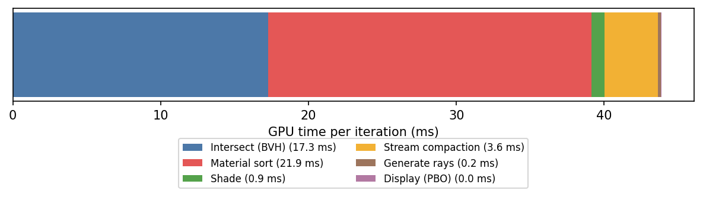
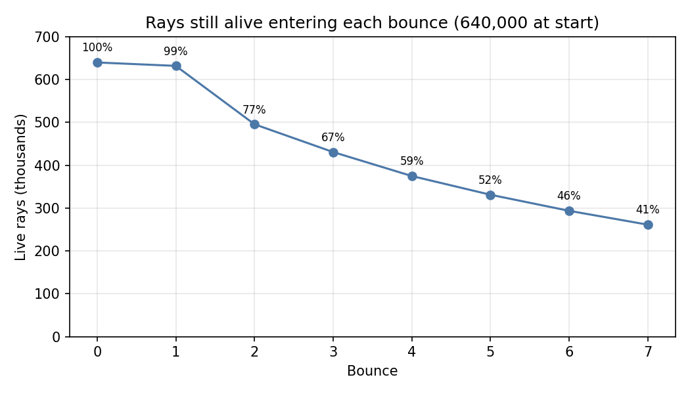
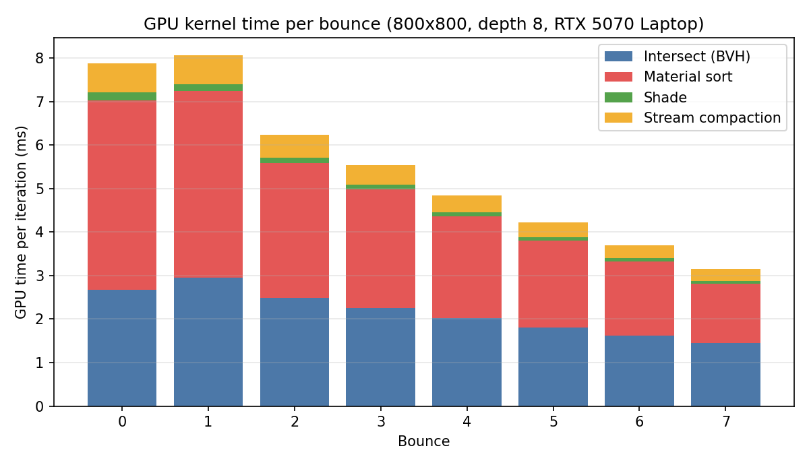

CUDA Path Tracer
================

**University of Pennsylvania, CIS 565: GPU Programming and Architecture, Project 3**

* Sau Lok Li
* Tested on: Windows, AMD Ryzen 9 270 w/ Radeon 780M Graphics, NVIDIA GeForce RTX 5070 Laptop GPU (8151 MiB), driver 596.13



A GPU path tracer written in CUDA that renders arbitrary glTF models inside a fully path-traced environment. The cover scene is a desk lit by a ceiling panel and a glowing lamp bulb, with a red gem, a gold and a chrome sphere on the desktop, a full-length arched mirror, and a wire waste basket.

## Features

* CUDA path tracing with diffuse, emissive and specular (mirror) materials
* glTF mesh loading with [tinygltf v3](https://github.com/syoyo/tinygltf), with scene-level placement (translate / rotate / scale) driven from JSON
* Per-mesh and per-triangle AABB culling, togglable at runtime from the ImGui panel so the speedup can be measured live
* ImGui analytics panel: trace depth, intersection kernel time, frame time and FPS
* Refraction with a per-material index of refraction
* BVH acceleration for triangle meshes 
* Material sorting to group rays by material before shading, reducing warp divergence in the shading kernel

## Gallery

| Glass | Refraction |
|---|---|
|  |  |
| Stochastic antialiasing (off) | Stochastic antialiasing (on) |
|  |  |


## Loading glTF models

Meshes are loaded through `loadGLTF`, which flattens every triangle primitive into one triangle array and records the start index, count and bounding box on the owning `Geom`. The mesh `Geom` then carries its own transform from the scene JSON, so one model file can be instanced at any position, rotation and scale.

Models exported from Sketchfab store their orientation and scale in nested node matrices (for example, a -90° rotation to convert from Z-up to Y-up, and 0.059 and 0.01 scale factors on the lamp and mirror). The renderer reads raw vertex data, so these transforms are baked into the vertex positions and normals in an offline step. After baking, each model is a single node with world-space geometry, which means the scene JSON can be written in real units:

| Model | Triangles | Size |
|---|---|---|
| Desk | 144 | 4.8 × 3.0 × 2.6 |
| Lamp | 31,282 | 1.9 × 2.6 × 0.9 |
| Mirror | 1,230 | 0.6 × 1.7 × 0.04 |
| Basket | 45,684 | 0.34 × 0.29 × 0.34 |
| Gem | 30 | 41.6 × 33.5 × 41.6 (placed at scale 0.014) |

The cover scene totals about 78,000 triangles.

## Scene description

Objects are placed from JSON; each mesh entry picks a model file, a material and a transform:

```json
{
    "TYPE": "gltf",
    "FILE": "scenes/lamp.gltf",
    "MATERIAL": "diffuse_black",
    "TRANS": [-1.3, 2.69, -0.1],
    "ROTAT": [0, 0, 0],
    "SCALE": [0.8, 0.8, 0.8]
}
```

## Performance analysis
 
All numbers below come from an Nsight Systems capture of the desk scene (about 78,000 triangles) over 155 iterations at 800×800, trace depth 8, on an RTX 5070 Laptop GPU in a Release build, with BVH, material sorting and stream compaction enabled. Times are GPU kernel durations per iteration, so they exclude CPU work and display overhead.
 
### Where the time goes
 

 
| Stage | ms / iteration | Share |
|---|---|---|
| Intersect (BVH traversal) | 17.3 | 39.4% |
| Material sort | 21.9 | 49.8% |
| Stream compaction | 3.6 | 8.3% |
| Shade | 0.87 | 2.0% |
| Generate rays + display | 0.25 | 0.6% |
| **Total** | **43.9** | |
 
### Stream compaction
 
An iteration starts with 640,000 paths. Rays that leave the room terminate, and compaction removes them, so each later bounce launches fewer threads. Intersection time follows the live ray count closely:
 

 
| Bounce | 0 | 1 | 2 | 3 | 4 | 5 | 6 | 7 |
|---|---|---|---|---|---|---|---|---|
| Live rays (thousands) | 640 | 632 | 496 | 431 | 375 | 331 | 294 | 261 |
| Intersect (ms) | 2.68 | 2.95 | 2.49 | 2.26 | 2.03 | 1.80 | 1.62 | 1.45 |
 
By bounce 7, 41% of the paths are still alive, and the intersection kernel runs in about half the time of bounce 1. Compaction itself costs 3.6 ms per iteration (8% of GPU time) and is cheapest exactly when it removes the most rays.
 
### Per-kernel breakdown

Use stacked bars: one bar per configuration, one segment per kernel (generate rays, intersect, shade, compaction/sort, final gather), with timings from Nsight Systems or Nsight Compute.
 

 
Sorting is the largest single cost in this capture, at 21.9 ms per iteration. That is more than the intersection kernel and about 25× the shading kernel it exists to speed up (0.87 ms). Even if sorting made shading free, it could not pay for itself on the shade kernel alone, so any benefit would have to come from better ray coherence in the next bounce's intersection.

## Build and run

1. Place the five models (`desk`, `lamp`, `gem`, `mirror`, `basket`, each a `.gltf` plus a `.bin`) in `scenes/`.
2. Configure and build with CMake (Visual Studio 2022 or later works well on Windows).
3. Run with the scene path as the first argument: `cis565_path_tracer scenes/custom_scene.json`

### Controls

* Esc to save an image and exit.
* S to save an image. Watch the console for the output filename.
* Space to re-center the camera at the original scene lookAt point.
* Left mouse button to rotate the camera.
* Right mouse button on the vertical axis to zoom in/out.
* Middle mouse button to move the LOOKAT point in the scene's X/Z plane.

## Credits and references

* [tinygltf v3](https://github.com/syoyo/tinygltf) for glTF parsing
* [Dear ImGui](https://github.com/ocornut/imgui) for the analytics panel
* [nlohmann/json](https://github.com/nlohmann/json) for scene parsing
* [GLM](https://github.com/g-truc/glm) for math
* 3D models (all from Sketchfab):
  * This work is based on ["Computer Desk"](https://sketchfab.com/3d-models/computer-desk-05353724b7884bfb81211c7033a57fd4) by [felixawani](https://sketchfab.com/felixawani), licensed under [CC-BY-4.0](http://creativecommons.org/licenses/by/4.0/)
  * This work is based on ["Desk lamp"](https://sketchfab.com/3d-models/desk-lamp-7377ec591df04445a1aae370017aaa13) by [KaramellGlass](https://sketchfab.com/KaramellGlass), licensed under [CC-BY-4.0](http://creativecommons.org/licenses/by/4.0/)
  * This work is based on ["Red Gem"](https://sketchfab.com/3d-models/red-gem-3dcfeb2d4d9c4f37bf0c1cd57bad5a29) by [bang_m](https://sketchfab.com/bang_m), licensed under [CC-BY-4.0](http://creativecommons.org/licenses/by/4.0/)
  * This work is based on ["Mirror B"](https://sketchfab.com/3d-models/mirror-b-cc2cc732368a44e8b3ad17d0ae0d86d0) by [DudleyLong](https://sketchfab.com/DudleyLong), licensed under [CC-BY-4.0](http://creativecommons.org/licenses/by/4.0/)
  * ["Wastebasket"](https://sketchfab.com/3d-models/wastebasket-a29b85c6a0fc4d5ba8bdc0f39fdc6384) by [mariocanfly](https://sketchfab.com/mariocanfly), used under the [Sketchfab Standard license](https://sketchfab.com/licenses)
  * The models were modified: node transforms were baked into the vertices and texture and material data was removed.
* [Tips for writing an awesome README](https://github.com/pjcozzi/Articles/blob/master/CIS565/GitHubRepo/README.md)